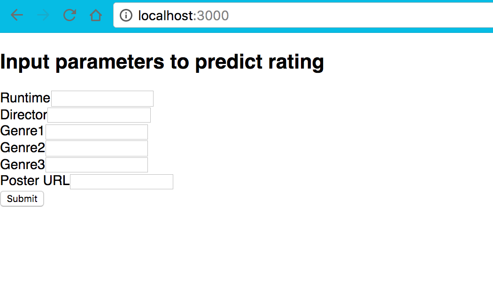
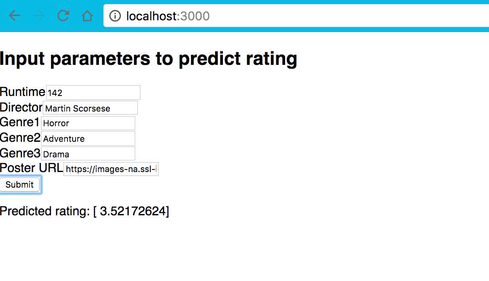

# Movie Rating Predictor
<hr>
This machine learning program will predict movie ratings based on runtime, director, genre, and poster image.

### Set-up 
Please download the models [here](http://bit.ly/2BE1eZ4)
and place the `models` folder in the same directory as predict_rating.py. 

JavaScript package manager, npm, and react (can be done through npm) should be installed.

Python 2.7 should be used.

You will need the following modules installed in your local machine in order to run the script:
```
numpy
pandas
sklearn
urllib
PIL
scipy
keras
tornado
```

### Run
Everything will run in localhost 127.0.0.1

Start the Tornado back-end:
```
$ cd server
$ python hi.py
```
If a window pops up asking "Do you want the application “Python.app” to accept incoming network connections?" click "Allow."

Start the React front-end:
```
$ cd ui
$ npm install
$ npm start
```

Go to "localhost:3000" in your browser.

### Parameters

| Parameter  | Data type  | Notes                                      |
| ---------  | ---------- | :----------------------------------------- |
| Runtime    | int        |                                            |
| Director   | string     | Only use the directors listed in `data/director_lst`|
| Genre      | string     | For all genre, only use genres listed in `data/genres_list`|
| Poster URL | string     | Only use IMDB image url's. Goto the IMDB page for a movie; click the poster image; right-click and select 'Copy Link Address' or equivalent  |


### Result
Please wait for around 5 seconds for the prediction output.
The output will be shown as follows:
```
Predicted rating: [ x ] 
```
where x is the rating (double) that follows a 5-star rating system [0-5]. 

<hr>

## Minimum Viable Product (MVP)

#### Screenshots
Starting Screen            |  Results Screen
:-------------------------:|:-------------------------:
 |

The best way to see the MVP is to checkout the commit with message "MVP Done": `$ git checkout 50760f0`. You should restart the back-end server. After you are done looking around, you can go back to the most current branch by`$ git checkout master`.


## 1st Iteration

#### Rebekah
* Drop-down menu for Director, Genre
* Star Rating display 
* "Prettier" UI 
	- Display poster passed
	- Slide show of posters

#### Richard
* Improve model by adding more features (actors)
* Try different model storage to improve prediction speed, if possible

#### Valmik
* Error Handling
* Decouple pre processing and predictor

#### Screenshot

